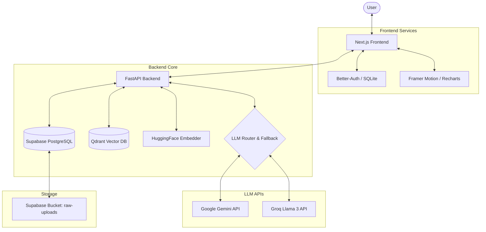

# Advance RAG

A production-grade, domain-aware Retrieval-Augmented Generation (RAG) platform designed for document ingestion, session-based exploration, and structured Q&A across **Finance**, **Law**, and **Global** domains.

This repository integrates a **FastAPI** backend with a modern **Next.js** frontend, leveraging **Supabase** for relational storage, **Qdrant** for vector search, **HuggingFace** embeddings, and a dynamic LLM routing model powered by **Google Gemini** and **Groq**.

---

## 🏗️ System Architecture

The diagram below illustrates the system architecture, showing the flow of data during ingestion, retrieval, and analysis:



---

## ✨ Core Features

### 1. Multi-Domain Context Isolation
*   **Finance Workspace**: Supports CSV files containing transaction sheets. Automatically generates financial trends, category totals, currency breakdowns, and aggregates.
*   **Law Workspace**: Processes PDF and TXT legal document corpora. Tailored system prompts extract legal warnings, compliance flags, and recommendations.
*   **Global Workspace**: General-purpose ingestion and retrieval supporting CSV, PDF, and TXT files for generic document Q&A.

### 2. Intelligent Ingestion Pipeline
*   **Dynamic Column Mapping**: When uploading transaction CSVs, the system automatically identifies column shapes. Users can map non-standard columns (e.g., `date_recorded` ➡️ `transaction_date`, `spent_val` ➡️ `amount`) via a schema mapper modal.
*   **Memory-Safe Processing**: File payloads are parsed entirely in memory and streamed directly to Supabase storage to avoid local disk leaks.
*   **Embedding Caching**: Text chunks are hashed and matched against a PostgreSQL `embedding_cache` table to prevent redundant API calls to embedding models.

### 3. Financial Analytics & Natural-Language Charts
*   Automatically computes summary statistics (average monthly spend, highest/lowest transactions, category distributions) on CSV ingestion.
*   **NLP Chart Extraction**: Integrates a heuristic query preprocessor that detects chart-related keywords (e.g., `graph`, `trend`, `categories`) and extracts filters (e.g., `"top 5 categories"`, `"transactions over 500"`, `"spending between 200 and 1000"`).
*   Generates custom JSON payloads rendered in the frontend using interactive **Recharts** charts.

### 4. Relational & Vector Search Integration
*   Uses `sentence-transformers/all-MiniLM-L6-v2` to generate 384-dimensional dense vectors.
*   Enforces strict session boundaries by adding `session_id` tags to Qdrant vector metadata, preventing cross-workspace data leakage.
*   Structured output guarantees: The LLM pipeline enforces strict structured JSON formats containing:
    *   `insights` (Key factual findings)
    *   `warnings` (Potential risks or anomalies)
    *   `recommendations` (Actionable steps)
    *   `data` (Supporting facts, metrics, or table payloads)

### 5. Chat History & Periodic Summarization
*   Maintains full chat logs with latency metrics, average retrieval scores, and model metadata.
*   Runs a periodic background summarizer. When the conversation grows, it generates a concise context summary in the `memory_summaries` table to preserve conversation context without exceeding LLM context windows.

### 6. Sandbox Exploration Tools (Claude Code style)
Exposes database-level directory/sandbox navigation tools through API endpoints:
*   `ls`: Lists virtual folders and documents in the active workspace directory.
*   `tree`: Visualizes the hierarchical directory structure up to a specified depth.
*   `glob`: Filters files using pattern matching.
*   `gp` (grep): Runs regex-based or exact searches across document contents.
*   `read`: Reads target line numbers/ranges from processed document markdowns.

---

## 🛠️ Tech Stack

### Backend
*   **FastAPI / Uvicorn**: Async API server.
*   **Supabase (PostgreSQL + Storage)**: Relational metadata, chat history, and raw files.
*   **Qdrant**: Vector database.
*   **Pydantic**: Data validation and response schemas.
*   **HuggingFace Embeddings**: Sentence-transformers for vector representations.
*   **Gemini & Groq client SDKs**: Active LLM providers.

### Frontend
*   **Next.js 16 (App Router)**: Core React framework.
*   **React 19 / TypeScript**: UI components and type safety.
*   **Better Auth + Better SQLite3**: Local user authentication and session management.
*   **Tailwind CSS 4**: Modern styling engine.
*   **Recharts**: Custom interactive analytics rendering.
*   **Framer Motion**: Smooth micro-animations.

---

## 🚀 Setup & Installation

### Prerequisites
*   Python 3.10+
*   Node.js 18+
*   Supabase Account and Project
*   Qdrant Cloud or Local Instance
*   API keys for HuggingFace, Gemini, and Groq

---

### 1. Backend Setup

1.  **Navigate and configure virtual environment**:
    ```bash
    cd backend
    python -m venv .venv

    # Windows
    .venv\Scripts\activate
    
    # macOS / Linux
    source .venv/bin/activate

    pip install -r requirements.txt
    ```

2.  **Environment Variables**:
    Create a `backend/.env` file from the example configuration:
    ```bash
    cp .env.example .env
    ```
    Populate the variables:
    ```env
    # Supabase Connection
    SUPABASE_URL=your-supabase-url
    SUPABASE_SERVICE_ROLE_KEY=your-supabase-service-key

    # Qdrant Vector DB
    QDRANT_URL=your-qdrant-url
    QDRANT_API_KEY=your-qdrant-api-key

    # LLM & Embedding Providers
    HUGGINGFACE_API_TOKEN=your-hf-token
    GEMINI_API_KEY=your-gemini-key
    GROQ_API_KEY=your-groq-key

    # Server Settings (Optional)
    ALLOWED_ORIGINS=http://localhost:3000
    PORT=8000
    ```

3.  **Database Migration Setup**:
    Apply the SQL scripts located in `backend/migrations/` sequentially in your Supabase SQL editor:
    1.  [001_initial_schema.sql](file:///c:/Hackthon/Advance_Rag/backend/migrations/001_initial_schema.sql) — Generates base tables (`chat_sessions`, `uploaded_files`, `messages`, `memory_summaries`, `embedding_cache`).
    2.  [002_folders_and_exploration.sql](file:///c:/Hackthon/Advance_Rag/backend/migrations/002_folders_and_exploration.sql) — Enhances files table and adds the `folders` schema for exploration tools.
    3.  [003_session_name.sql](file:///c:/Hackthon/Advance_Rag/backend/migrations/003_session_name.sql) — Adds display names to chat sessions.
    4.  [004_allow_global_domain.sql](file:///c:/Hackthon/Advance_Rag/backend/migrations/004_allow_global_domain.sql) — Relaxes domain constraints to support global workspaces.

4.  **Run Development Server**:
    ```bash
    uvicorn main:app --reload --port 8000
    ```

---

### 2. Frontend Setup

1.  **Install dependencies**:
    ```bash
    cd frontend
    npm install
    ```

2.  **Environment Variables**:
    Create a `frontend/.env` file:
    ```env
    NEXT_PUBLIC_API_URL=http://localhost:8000
    NEXT_PUBLIC_AUTH_BASE_URL=http://localhost:3000
    BETTER_AUTH_SECRET=a_random_32_character_string
    ```

3.  **Authentication Database**:
    Better Auth will automatically initialize its database schema inside a local SQLite file named [sqlite.db](file:///c:/Hackthon/Advance_Rag/frontend/sqlite.db) upon first run.

4.  **Run Development Server**:
    ```bash
    npm run dev
    ```
    Access the UI at `http://localhost:3000`.

---

## 🔌 API Endpoints Reference

All routes are prefixed with `/api/v1`.

### Workspace Sessions
*   `POST /sessions`: Start a new chat session. Enforces domain parameter (`finance`, `law`, `global`).
*   `GET /sessions`: Retrieve active sessions for the authenticated user.
*   `PATCH /sessions/{session_id}`: Rename a session.
*   `DELETE /sessions/{session_id}`: Soft-deletes a session and flushes its vector points in Qdrant.

### File Ingestion & Exploration
*   `POST /ingest`: Ingests and processes a document. Accepts optional folder IDs and CSV mapping keys.
*   `DELETE /files/{file_id}`: Removes the document from database, Supabase storage, and Qdrant collections.
*   `GET /files/{file_id}/chart`: Fetches pre-calculated financial metrics with optional query-based overrides.

### RAG Operations
*   `POST /query`: Dispatches search terms, runs hybrid retrieval, triggers LLM pipelines, and saves memory.
*   `GET /sessions/{session_id}/history`: Paginated workspace history.
*   `GET /sessions/{session_id}/memory`: Fetches the background memory summary for the active session.

### Directory Exploration (DB Sandbox)
*   `GET /tools/ls`: Directory list of files and subfolders.
*   `GET /tools/tree`: Recursive tree representing workspace file hierarchies.
*   `GET /tools/glob`: Locates files matching standard wildcards.
*   `GET /tools/gp` (grep): Runs full-text pattern match (string or regex) against files.
*   `GET /tools/read`: Stream precise line limits of file markdown content.

### System Control & Settings
*   `GET /settings/llm`: Current active model routing properties.
*   `PUT /settings/llm`: Modify active models (temperature, token ceilings, timeout settings).
*   `GET /health/deep`: Returns health reports of external service bindings (Qdrant connectivity, Supabase connection status).

---

## 🧪 Testing

The backend includes test suites verifying core pipelines, query routing, and currency checks. Run tests using `pytest`:

```bash
cd backend
pytest
```
